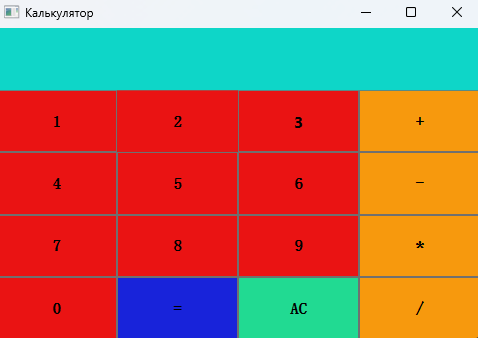
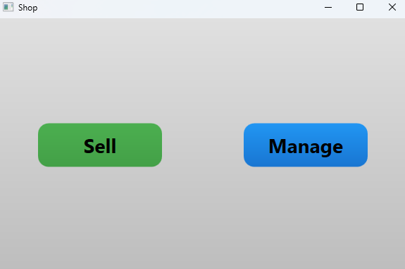
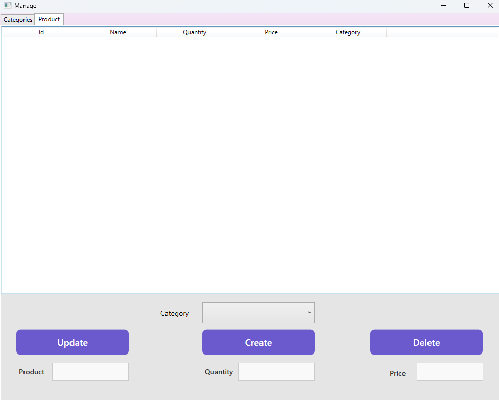
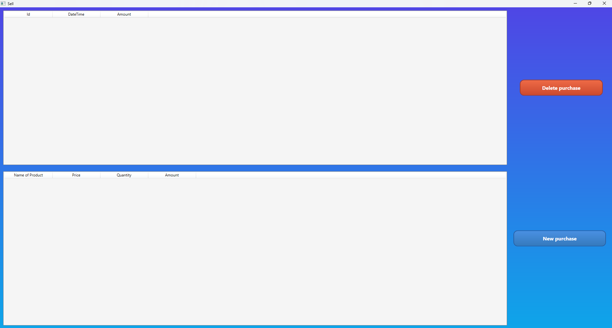
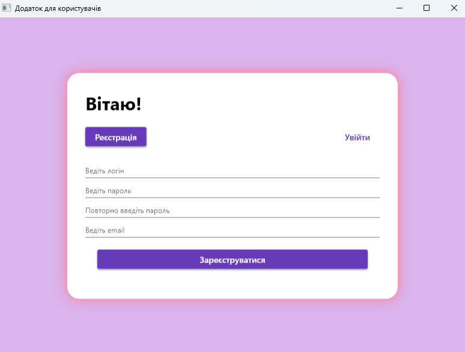
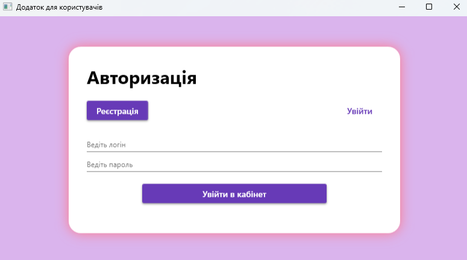

# AIS Design C# Applications

A collection of three C# desktop applications developed for the **Automated Information Systems (AIS) Design** course. This repository demonstrates modern WPF (Windows Presentation Foundation) application development with various UI patterns and data management techniques.

## 📚 Table of Contents

- [Projects Overview](#projects-overview)
- [Technologies Used](#technologies-used)
- [Getting Started](#getting-started)
- [Project Details](#project-details)
  - [Calculator Application](#1-calculator-application)
  - [Shop Management System](#2-shop-management-system)
  - [User Management Application](#3-user-management-application)
- [Screenshots](#screenshots)
- [License](#license)
- [Author](#author)

## 🎯 Projects Overview

This repository contains three distinct WPF applications:

1. **Calculator** - A functional desktop calculator application
2. **Shop** - A comprehensive shop management system for products, categories, and purchases
3. **UsersApp** - A user authentication and registration system with database integration

## 🛠 Technologies Used

- **Language**: C# (.NET Framework)
- **UI Framework**: WPF (Windows Presentation Foundation)
- **IDE**: Visual Studio
- **Database**: Entity Framework (for UsersApp)
- **XAML**: For user interface design

## 🚀 Getting Started

### Prerequisites

- Windows OS
- Visual Studio 2019 or later
- .NET Framework 4.7.2 or higher

### Installation

1. Clone the repository:
   ```bash
   git clone https://github.com/TeslenkoPavlo/AIS-Design-CSharp-Apps-.git
   ```

2. Open the desired project solution file in Visual Studio:
   - `Calculator/Calculator.sln`
   - `Shop/Shop.sln`
   - `UsersApp/UsersApp.sln`

3. Build the solution:
   - Press `Ctrl + Shift + B` or
   - Go to `Build > Build Solution`

4. Run the application:
   - Press `F5` or
   - Click the "Start" button in Visual Studio

## 📖 Project Details

### 1. Calculator Application

A desktop calculator with a clean and intuitive interface that performs basic arithmetic operations.

**Features:**
- Basic arithmetic operations (addition, subtraction, multiplication, division)
- Clear and intuitive button-based interface
- Real-time calculation display
- Expression evaluation

**Screenshot:**



### 2. Shop Management System

A comprehensive application for managing a shop's inventory, categories, and sales transactions.

**Features:**
- **Main Menu**: Central navigation hub for all shop operations
- **Product Management**: Add, edit, and delete products
- **Category Management**: Organize products into categories
- **Purchase Creation**: Create new purchase orders
- **Purchase Management**: View and delete existing purchases

**Screenshots:**

**Main Menu:**


**Managing Products:**


**Managing Categories:**


**Creating a Purchase:**


**Viewing and Deleting Purchases:**


### 3. User Management Application

A user authentication system with registration and login functionality, demonstrating database integration patterns.

**Features:**
- User registration with validation
- User authentication (login system)
- Database integration using Entity Framework
- Secure user data management
- User profile pages

**Screenshots:**

**Registration Window:**


**Authorization Window:**


## 📸 Screenshots

All application screenshots are organized in the `assets/` directory:

```
assets/
├── Calculator/
│   └── CalculatorMenu.png
├── Shop/
│   ├── MainMenu.png
│   ├── ManagingProducts.png
│   ├── ManagingCategories .png
│   ├── CreatePurchase.png
│   └── NewDeletePurchase.png
└── UsersApp/
    ├── RegistrationWindow.png
    └── AuthorizationWindow.png
```

## 📄 License

This project is licensed under the MIT License - see the [LICENSE](LICENSE) file for details.

```
MIT License
Copyright (c) 2025 PAVLO TESLENKO
```

## 👤 Author

**Pavlo Teslenko**

- GitHub: [@TeslenkoPavlo](https://github.com/TeslenkoPavlo)

---

*Developed as part of the Automated Information Systems (AIS) Design course*
